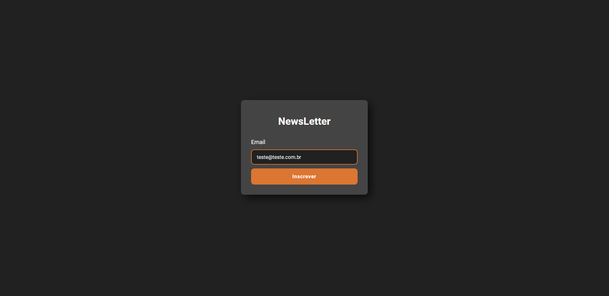
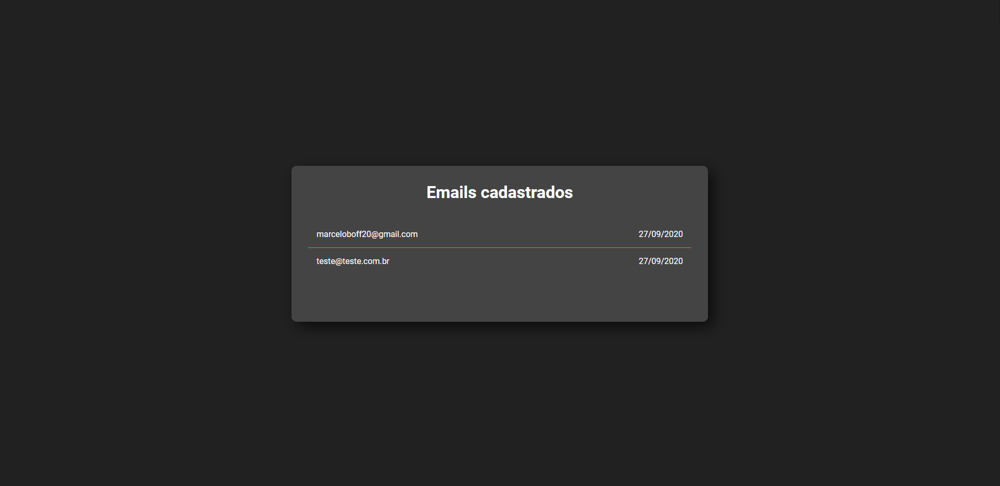

<h1 align="center">
  <h2 align="center">Newsletter</h2>

  <h4 align="center">
      This application is to subscribe in a newsletter
  </h4>

  <a href="https://newsletter-boff.vercel.app/">
    Live Demo
  </a>
</h1>

---

<p align="center">
  

  

  

  
</p>

<h2>📔 Description</h2>

###

`Application`

<details>
  <summary>See</summary>




</details>

<h2>🗺 Serverless Routes</h2>

| Method | Path           | Description     |
| ------ | -------------- | --------------- |
| GET    | /list          | List emails     |
| ANY    | /api/subscribe | Subscribe email |
| ANY    | /api/list      | Get all emails  |

<h2>🚀 Technologies</h2>

- [Typescript](https://www.typescriptlang.org/)
- [ReactJS](https://pt-br.reactjs.org/)
- [NextJS](https://nextjs.org/)
- [Axios](https://github.com/axios/axios)
- [Styled-components](https://styled-components.com/)
- [ESLint](https://eslint.org/)
- [Prettier](https://prettier.io/)
- [MongoDB](https://www.mongodb.com/)

<h2>❓ How to use</h2>

You need a MongoDb intance running and config MONGODB_URI on .env

```bash
# Clone this repository
$ git clone https://github.com/MarceloHBoff/newsletter

# Go into the repository
$ cd newsletter

# Install dependencies for the frontend
$ yarn

# Run the frontend
$ yarn dev

# Acess http://localhost:3000
```

Made with love by [Marcelo Boff!](https://www.linkedin.com/in/marcelo-boff)
